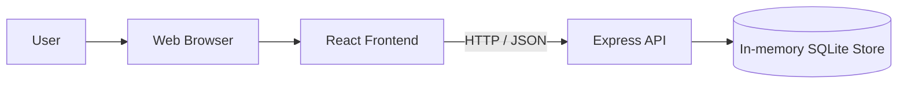
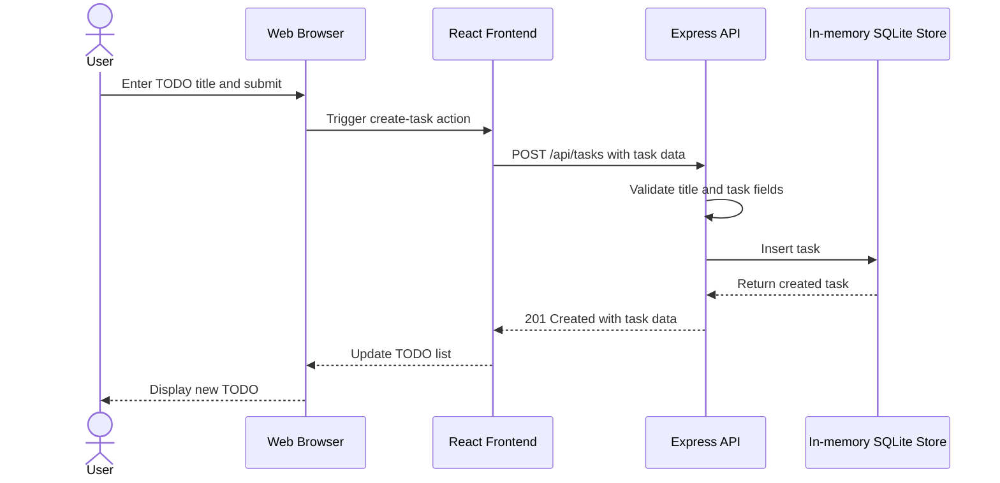

# Cloud Architecture Overview

The application is a small monorepo with a React frontend, an Express API, and an in-memory SQLite store owned by the backend. Task data is held for the lifetime of the API process and is not persisted externally.

## Creating a TODO

- The React frontend provides the task-management user interface.
- The Express API handles task requests and validation.
- The in-memory SQLite store holds task data while the backend process is running.
- No external database, cloud service, or persistent storage is part of the current architecture.
